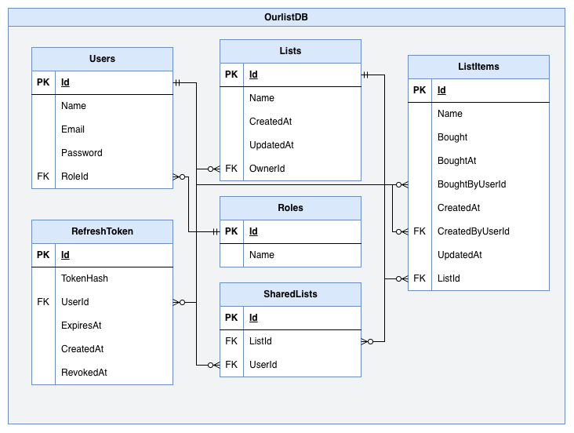

# Ourlist_WebAPI

REST API for a shared shopping list app. Users create lists, share them with
others, and see changes in real time.

Built with ASP.NET Core (.NET 10), PostgreSQL and Entity Framework Core.

The frontend is a separate Next.js app:
[shopping_list_app](https://github.com/EmanuelSchweizer/shopping_list_app).

## Features

- Live updates for list items with SignalR (see below)
- JWT authentication with refresh token rotation
- Roles: user, admin and a read-only demo admin
- Shared lists with per-user access control
- Rate limiting and API key protection
- Global exception handling

## Tech stack

| | |
|---|---|
| Framework | ASP.NET Core (.NET 10) |
| Database | PostgreSQL + EF Core |
| Auth | JWT (HS256), hashed refresh tokens |
| Live updates | SignalR |
| Docs | OpenAPI / Scalar |
| Hosting | Railway (Docker) |

## Running locally

```bash
dotnet run --project ShoppingList_WebAPI
```

Requires a PostgreSQL instance. Set the connection string in
`appsettings.Development.json`, plus `ApiKey`, `Jwt:Secret`, `Jwt:Issuer` and
`Jwt:Audience`. Migrations are applied automatically on startup.

Every request needs the API key in the `X-API-Key` header, except the API docs
and the SignalR hub.

CORS allows `http://localhost:3000` by default. To allow other frontends (for
example the deployed one), set `Cors:AllowedOrigins`, which is an array. As
environment variables that is `Cors__AllowedOrigins__0`, `Cors__AllowedOrigins__1`
and so on.

API docs are available at `/scalar/v1` in development.

## Live updates

When someone adds, renames, checks off or removes an item, everyone who has that
list open sees it without reloading.

- The hub is at `/hubs/shoppingList`. The client connects with its JWT (sent as
  `access_token` in the query string, because browsers can't set headers on a
  WebSocket).
- After connecting, the client calls `JoinList(listId)` for each of its lists.
  The hub checks in the database that the user owns the list or has it shared
  with them, then adds the connection to a group `list-{id}`.
- After an item is saved, `ListItemsService` sends `ItemAdded`, `ItemUpdated` or
  `ItemDeleted` to that group. The sender gets the event too, so the client has
  to ignore duplicates.

Only list items are live. Renaming or sharing a list itself still needs a reload
on the other side.

## Database model


